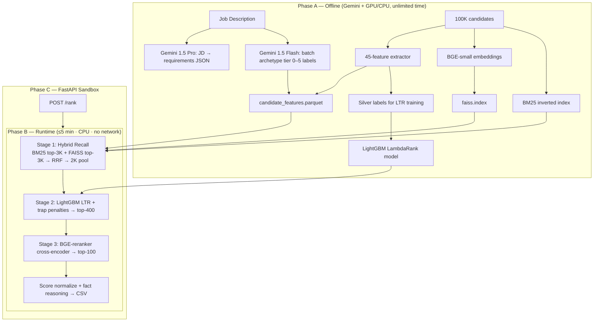

# Redrob IndiaRuns — Technical Plan v2.0
**Intelligent Candidate Discovery & Ranking System**

| Field | Value |
|-------|-------|
| Role target | Senior AI Engineer — Founding Team (Redrob) |
| Stack | Python 3.11 · FastAPI · Gemini · BGE + BM25 + Cross-Encoder · LightGBM |
| Dataset | 100,000 candidates → Top 100 ranked CSV |
| Hard constraint | Ranking: ≤5 min · 16 GB RAM · CPU only · **no network** |
| Primary metric | **NDCG@10 = 50%** of final score |

---

## 0. v1 → v2 Changes

| v1 | v2 | Impact on NDCG@10 |
|----|----|-------------------|
| `all-MiniLM-L6-v2` bi-encoder only | **BGE-small-en-v1.5** + **BM25 hybrid (RRF)** | Higher retrieval recall — JD asks for hybrid search |
| Single FAISS recall → heuristic score | **3-stage funnel:** RRF recall → LightGBM LTR → Cross-encoder rerank | Reranking top-K improves top-10 precision |
| Hand-tuned linear weights | **LightGBM LambdaRank** on 45+ features + silver labels | Non-linear trap interactions |
| Rule-only trap detection | Rules + **Gemini offline archetype labels** (tier 0–5) cached per candidate | Covers plain-language profiles without exact JD keywords |
| Template reasoning only | Fact-anchored templates + **JD-specific evidence slots** | Stage 4 manual review |
| pandas preprocessing | **Polars** + precomputed Parquet | Faster preprocessing |
| No cross-encoder | **BGE-reranker-base** on top-400 pairs | Improved top-10 ordering |

v2 aligns with the JD stack: BM25 → embeddings → LTR → rerank.

---

## 1. Strategy (Scoring Formula)

```
Final Score = 0.50×NDCG@10 + 0.30×NDCG@50 + 0.15×MAP + 0.05×P@10
```

| Priority | Focus | Approach |
|----------|-------|----------|
| **P0** | Top-10 quality | Cross-encoder rerank + honeypot hard-filter on top-500 |
| **P1** | Top-50 quality | LightGBM LTR on 45 features |
| **P2** | Full 100 MAP | Behavioral modifier + marginal candidates at 80–100 |
| **P3** | Stage 3 survival | Honeypot rate <5%, reproduce <60s, no API at runtime |
| **P4** | Stage 4–5 | Architecture aligned to Redrob JD requirements |

**Inferred relevance tiers (from JD + submission spec):**
- Tier 5: Strong fit — senior AI/search engineer, product co., India, active
- Tier 4: Good fit — ML engineer with production retrieval
- Tier 3: Relevant (counts for P@10) — adjacent ML, transition profiles
- Tier 2: Weak — software/data with ML interest
- Tier 1: Poor — keyword stuffers, wrong domain
- Tier 0: Honeypots + hard disqualifiers → must not appear in top 100

---

## 2. Architecture — 3-Stage Retrieval-Rank Funnel



---

## 3. Tech Stack (Constraint-Safe)

| Layer | Technology | Rationale |
|-------|------------|-----------|
| Language | **Python 3.11** | Spec requirement, ML ecosystem |
| LLM (offline) | **Gemini 1.5 Pro** (JD parse) + **Flash** (batch tier labeling) | Cost-efficient 100K batch classification; not used at runtime |
| API | **FastAPI** + Uvicorn | Sandbox requirement |
| Bi-encoder | **`BAAI/bge-small-en-v1.5`** | JD names BGE; stronger MTEB retrieval vs MiniLM; 384-dim, CPU-fast |
| Sparse retrieval | **`rank_bm25` (BM25Okapi)** | JD references BM25; catches exact skill/title matches dense retrieval may miss |
| Fusion | **Reciprocal Rank Fusion (RRF)** | Standard hybrid merge; k=60 |
| Cross-encoder | **`BAAI/bge-reranker-base`** | CPU-feasible reranker; 400 pairs ≈ 45s |
| Learning-to-rank | **LightGBM** (`lambdarank`) | JD mentions LTR/XGBoost; non-linear feature interactions |
| Vector index | **FAISS IndexFlatIP** (pre-normalized) | 100K×384 search <1s |
| Feature store | **Polars** → Parquet | Faster than pandas on 100K rows |
| Fuzzy matching | **rapidfuzz** | Title/summary mismatch at scale |
| Embeddings runtime | **ONNX Runtime** (optional) | Faster inference if needed |
| Validation | `validate_submission.py` | Pre-upload format check |
| Tuning | **Optuna** | Bayesian hyperparameter optimization |
| Sandbox | Docker + HuggingFace Spaces | Stage 3 reproduction |

> **Gemini rule:** Zero API calls during `rank.py` execution. All Gemini outputs are cached as artifacts.

---

## 4. Algorithms (Detailed)

### 4.1 Stage 1 — Hybrid Recall

```
Input: JD text + 100K precomputed embeddings + BM25 index

BM25_query = tokenize(JD + expanded_must_have_skills)
bm25_top   = BM25.top_k(query, k=3000)
dense_top  = FAISS.search(jd_embedding, k=3000)

RRF_score(d) = Σ 1/(k + rank_in_list)   for each list containing d, k=60
pool = top 2000 by RRF_score

Purpose: Plain-language candidates (no exact JD keywords)
         still enter pool via dense + career-text BM25
```

### 4.2 Feature Engineering — 45 Features (precomputed)

| # | Feature group | Features (examples) |
|---|---------------|---------------------|
| 1–5 | Title fit | title_tier, title_in_jd_targets, seniority_match, title_jd_semantic_sim |
| 6–10 | Coherence | summary_title_mismatch, career_desc_uniqueness, template_match_count, role_desc_sim |
| 11–18 | Skill trust | jd_skill_match_count, **skill_trust_weighted**, avg_duration, max_endorsement, assessment_avg, stuffing_flag |
| 19–24 | Career | product_company_ratio, consulting_only_flag, career_progression, search_ranking_keywords_in_history |
| 25–28 | Experience | yoe, yoe_in_band, band_distance |
| 29–32 | Education | tier_score, cs_ai_field, best_institution_tier |
| 33–38 | Location | india_flag, preferred_city_match, relocate_flag, work_mode_match |
| 39–45 | Behavioral | response_rate, recency_days, open_to_work, saved_by_recruiters, github_score, notice_period, interview_rate |

**Skill Trust (anti keyword-stuffing):**
```python
for skill in matched_jd_skills:
    trust = PROF[proficiency] * min(duration_months/24, 1) * min(log1p(endorsements)/3, 1)
    if skill in skill_assessment_scores:
        trust *= assessment_score / 100   # Redrob verified signal
skill_trust = mean(trust) - 0.5 * stuffing_flag
```

**Career Role Coherence:**
```python
for role in career_history:
    sim = cosine(embed(role.title + role.description), embed(role.title + expected_desc_for_title))
coherence = mean(sim)   # Low sim → recycled template trap
```

**Honeypot Detector (12 rules → hard eliminate):**
```
R1  expert skill + duration_months == 0
R2  tenure_months > months_since_company_founded + 6
R3  education end_year < start_year
R4  salary min > max
R5  10+ expert skills, avg duration < 6mo
R6  yoe < sum(career_duration_months) / 12 - 2
R7  all career descriptions in KNOWN_TEMPLATE_SET
R8  github == -1 AND claims OSS expert
R9  assessment_score > 90 AND proficiency == beginner
R10 last_active > 365 days AND rank candidate < 50 candidate
R11 summary says "marketing manager", title unrelated, 8+ AI skills
R12 Gemini archetype tier == 0 (offline label)
→ if honeypot_score >= 0.6: final_score = 0 (exclude from top 100)
```

### 4.3 Stage 2 — LightGBM LambdaRank

```
Training (offline):
  Silver labels y ∈ {0,1,2,3,4,5} from:
    - Manual labeling of ~150 candidates (senior AI engineers + known traps)
    - Heuristic rules (title tier, product company, search keywords)
    - Gemini Flash tier labels (batch, cached)
  Query group = single JD (all 100K in one group)
  Model: LightGBM LTR, metric=ndcg, ndcg_eval_at=[10,50]
  Validation: leave-out 20 manual labels, optimize NDCG@10

Runtime:
  Input: 2000 candidates from Stage 1
  ltr_score = lgbm.predict(features_45)
  trap_penalty = subtractive from §4.2
  behavioral_mult = multiplicative modifier (0.55–1.15)
  stage2_score = (ltr_score - trap_penalty) * behavioral_mult
  → top 400 to Stage 3
```

### 4.4 Stage 3 — Cross-Encoder Rerank

```
For each candidate in top-400:
  pair_text = JD_summary[:1500] + [SEP] + candidate_profile_text[:1500]
  ce_score = bge_reranker.predict(JD, profile)   # batched, batch_size=16

final_score = 0.55 * normalize(ce_score)
            + 0.30 * normalize(stage2_score)
            + 0.15 * normalize(rrf_score)

Sort → top 100
Tie-break: candidate_id ascending
Normalize scores: rank1=0.99, step=-0.008, monotonic
```

Bi-encoders (FAISS) optimize recall; cross-encoders optimize precision for top-K ordering.

### 4.5 Behavioral Modifier (multiplicative)

```python
def behavioral_mult(signals):
    m = 1.0
    m *= 0.70 + 0.30 * int(signals.open_to_work)
    m *= 0.55 + 0.45 * signals.recruiter_response_rate
    m *= recency_decay(signals.last_active_date)      # 1.0 if <30d, 0.7 if >180d
    m *= 0.80 + 0.20 * min(signals.saved_by_recruiters_30d / 8, 1.0)
    m *= 0.75 + 0.25 * min(max(signals.github_activity_score, 0) / 60, 1.0)
    m *= 0.90 if signals.notice_period_days <= 30 else 0.80 if <=60 else 0.65
    return clamp(m, 0.55, 1.15)
```

### 4.6 Gemini Offline Usage (not in runtime)

| Job | Model | Input | Output |
|-----|-------|-------|--------|
| JD Parser | Gemini 1.5 Pro | Full JD text | `jd_requirements.json` |
| Archetype Labeler | Gemini 1.5 Flash | candidate profile (batched 50) | `tier_label` 0–5 per candidate → Parquet column |

**Archetype prompt core:** *"Given this JD for Senior AI Engineer at a recruiting AI startup, rate relevance 0–5. 0=honeypot/incoherent, 3=relevant, 5=ideal. Reason about career evidence, not keyword count."*

Cached labels used as LTR feature #46 and honeypot validation.

---

## 5. Reasoning Engine (Stage 4)

**No LLM at runtime.** Structured fact assembly:

```python
TEMPLATE = (
    "{title} ({yoe}y) at {company_type}: "
    "{evidence_sentence} "
    "Signals: response {rr:.0%}, github {gh:.0f}, saved×{saved}. "
    "{concern}"
)
# evidence_sentence pulled from:
#   - matched JD skills with duration
#   - career phrase: "shipped ranking/retrieval at {company}"
#   - assessment scores if present
# concern: notice>60, consulting-only, inactive — noted for rank>20
```

**Stage 4 requirements:**
- Specific facts from profile
- JD connection (retrieval / ranking / hybrid search)
- Honest gaps
- No hallucination (whitelist fields only)
- 100 unique reasonings (combinatorial template slots)

---

## 6. Silver Label Strategy (Proxy Ground Truth)

Hidden labels are unavailable; use a proxy training set:

| Source | Count | Label method |
|--------|-------|--------------|
| Known senior AI profiles | ~21 | Tier 5 |
| Recommendation/Search engineers | ~80 | Tier 4–5 |
| ML engineers at product companies | ~200 | Tier 3–4 |
| Software/data ML-transition | ~500 | Tier 2–3 |
| Keyword stuffers (detected) | ~5000 | Tier 1 |
| Honeypots (rule-detected) | ~80 | Tier 0 |
| Manual review random sample | 100 | Human labeled |

**Tuning target:** Maximize proxy **NDCG@10** and **P@10** via Optuna (500 trials).

---

## 7. Performance Budget

| Step | Time | Memory |
|------|------|--------|
| Load Parquet + FAISS + BM25 + LGB + reranker | 8–15 s | ~2 GB |
| BM25 top-3000 + FAISS top-3000 + RRF | 2–4 s | — |
| LightGBM predict 2000 | <1 s | — |
| Cross-encoder 400 pairs (batch=16, CPU) | 40–90 s | ~1.5 GB |
| Trap filter + reasoning + CSV | <5 s | — |
| **Total runtime** | **~60–120 s** | **<4 GB** |

Pre-computation (offline):
| Step | Time |
|------|------|
| BGE embeddings 100K | 20–40 min CPU |
| BM25 index build | 2 min |
| Feature extraction (Polars) | 5 min |
| Gemini tier labeling 100K (Flash) | ~30 min |
| LightGBM training | 2 min |
| **Total offline** | ~1–2 hours |

---

## 8. FastAPI + Project Structure

```
recruiter_candidate/
├── rank.py                     # reproduce_command entry
├── app/
│   ├── main.py                 # FastAPI
│   ├── pipeline.py             # 3-stage funnel orchestrator
│   ├── recall.py               # BM25 + FAISS + RRF
│   ├── features.py             # 45-feature extractor
│   ├── traps.py                # 12-rule honeypot detector
│   ├── ltr.py                  # LightGBM loader/predictor
│   ├── reranker.py             # BGE cross-encoder
│   ├── behavioral.py           # Signal modifier
│   ├── reasoning.py            # Fact templates
│   └── config.py
├── scripts/
│   ├── preprocess.py           # Full offline pipeline
│   ├── parse_jd.py             # Gemini Pro JD parser
│   ├── label_archetypes.py     # Gemini Flash batch labeler
│   ├── train_ltr.py            # LightGBM training
│   └── tune.py                 # Optuna NDCG@10 optimizer
├── artifacts/
│   ├── jd_requirements.json
│   ├── candidate_features.parquet
│   ├── bge_embeddings.npy
│   ├── faiss.index
│   ├── bm25.pkl
│   ├── ltr_model.lgb
│   └── gemini_tiers.parquet
├── challenge/
├── docs/
│   └── TECHNICAL_PLAN.md
├── requirements.txt
├── Dockerfile
└── README.md
```

### FastAPI Endpoints
| Method | Path | Description |
|--------|------|-------------|
| `GET` | `/health` | Health check |
| `POST` | `/rank` | Upload JSONL → ranked CSV + top-10 preview |
| `GET` | `/demo` | Run on `sample_candidates.json` |

---

## 9. Solution Approach

| Component | Implementation | Purpose |
|-----------|----------------|---------|
| Candidate matching | Skill trust scoring + title–career coherence + trap penalties | Evaluate genuine fit beyond keyword overlap |
| Retrieval | BM25 + FAISS dense search fused via RRF | Hybrid recall for skills, titles, and semantic profile text |
| Ranking model | LightGBM LambdaRank on 45+ features, tuned with Optuna | Non-linear scoring optimized for NDCG@10 |
| Precision layer | BGE cross-encoder rerank on top-400 candidates | Final top-10 ordering by JD–profile relevance |
| LLM usage | Gemini offline only — JD parsing + archetype tier labels, cached as artifacts | No API calls at runtime; Stage 3 reproducible |
| Behavioral signals | Multiplicative availability modifier on `redrob_signals` | Down-rank inactive or unresponsive candidates |
| Profile validation | 12-rule honeypot detector + Gemini tier-0 labels | Exclude incoherent or impossible profiles from top 100 |
| Explainability | Fact-anchored reasoning templates with JD-specific evidence slots | Honest, profile-grounded justification per ranked row |

---

## 10. Trap Handling Matrix

| Trap | Detection | Stage | Action |
|------|-----------|-------|--------|
| Keyword stuffer | 8+ AI skills, avg dur <12mo, non-ML title | 2 | −0.45 LTR penalty feature |
| Title–summary mismatch | rapidfuzz + marketing-manager pattern | 2 | −0.40 |
| Recycled career text | 8 KNOWN_TEMPLATES hash match | 2 | −0.35 |
| Honeypot (12 rules) | rules + Gemini tier=0 | 2 | **score = 0, exclude** |
| Consulting-only | all jobs in CONSULTING_SET | 2 | −0.30 |
| LangChain-only | >50% skills are framework names | 2 | −0.20 |
| Inactive | last_active >180d, response <0.1 | 2 | ×0.60 behavioral |
| Title-chaser | avg tenure <18mo across 4+ jobs | 2 | −0.15 |
| Research-only | academic titles, no production verbs | 2 | −0.25 |

**Target:** 0 honeypots in top 10 · <3 in top 100

---

## 11. Step-Wise Implementation

### Phase 0 — Setup (Day 1)
- [ ] Repo structure (§8)
- [ ] `requirements.txt`: fastapi, uvicorn, polars, pyarrow, numpy, lightgbm, sentence-transformers, faiss-cpu, rank-bm25, rapidfuzz, google-generativeai, optuna, onnxruntime
- [ ] Extract JD + submission docs to `artifacts/`

### Phase 1 — EDA + Silver Labels (Day 1)
- [ ] EDA: traps, honeypots, senior AI list, template hashes
- [ ] Build `labels_silver.parquet` (150 manual + heuristic + Gemini)
- [ ] Define `KNOWN_TEMPLATES` (8 recycled descriptions)

### Phase 2 — Offline Preprocessing (Day 2)
- [ ] `parse_jd.py` — Gemini Pro → `jd_requirements.json`
- [ ] `features.py` — 45 features → Parquet
- [ ] BGE-small embeddings + FAISS index
- [ ] BM25 index over profile text
- [ ] `label_archetypes.py` — Gemini Flash tiers → Parquet

### Phase 3 — Train LTR (Day 2–3)
- [ ] `train_ltr.py` — LightGBM LambdaRank on silver labels
- [ ] `tune.py` — Optuna optimize NDCG@10 proxy
- [ ] Validate: 21 senior AI engineers in top 30

### Phase 4 — 3-Stage Pipeline (Day 3–4)
- [ ] `recall.py` — BM25 + FAISS + RRF
- [ ] `ltr.py` + `traps.py` + `behavioral.py`
- [ ] `reranker.py` — BGE cross-encoder top-400
- [ ] `rank.py` — end-to-end CLI
- [ ] `validate_submission.py` passes

### Phase 5 — Reasoning + QA (Day 4–5)
- [ ] `reasoning.py` — 100 unique fact-based reasonings
- [ ] Honeypot audit on top 100
- [ ] Compare top-10 vs manual gold set
- [ ] Reproduce on clean 16GB CPU machine

### Phase 6 — FastAPI + Submission (Day 5–6)
- [ ] FastAPI `/rank` + Docker + HF Spaces
- [ ] `submission_metadata.yaml`
- [ ] PDF deck (9 sections)
- [ ] GitHub with incremental commit history

---

## 12. Expected Top-10 Profile (Sanity Check)

| Rank | Expected profile |
|------|-----------------|
| 1–3 | Senior AI Engineer · search/retrieval at product co. · FAISS/Pinecone · India · active |
| 4–7 | Senior ML / NLP Engineer · ranking systems shipped · github >60 |
| 8–10 | Recommendation/Search Engineer · strong behavioral signals · 5–8 YoE |

**Red flags in top 10:** HR Manager, Content Writer, Accountant, honeypots, consulting-only

---

## 13. Risk Register

| Risk | Likelihood | Mitigation |
|------|------------|------------|
| Cross-encoder too slow | Low | Batch=16, only 400 pairs; fallback to 200 |
| Silver labels ≠ hidden truth | Medium | Ensemble: rules + LTR + CE; avoid overfitting proxy |
| Gemini tier labels noisy | Medium | Use as feature, not sole filter |
| Artifacts >5GB disk | Low | float16 embeddings, compressed Parquet |
| Stage 5 interview depth | Medium | Document design choices; align to JD stack |

---

## 14. Deliverables Checklist

| # | Item | Stage |
|---|------|-------|
| 1 | Valid `submission.csv` | 1 |
| 2 | NDCG@10-optimized ranking | 2 |
| 3 | `rank.py` <5 min CPU reproducible | 3 |
| 4 | Honeypot rate <10% | 3 |
| 5 | Quality reasoning | 4 |
| 6 | PDF deck | 4 |
| 7 | FastAPI sandbox | 1/3 |
| 8 | Architecture walkthrough | 5 |

---

## 15. Summary

```
v1:  FAISS(MiniLM) → heuristic weights → top 100
v2:  BM25+FAISS(RRF) → LightGBM LTR → BGE cross-encoder → top 100
                              ↑                ↑
                    Gemini tiers (offline)   top-10 precision
```

v2 implements hybrid retrieval + learning-to-rank + cross-encoder reranking within all compute constraints.

---

*Document version: 2.0 · Aligned to submission_spec + job_description + dataset analysis*
